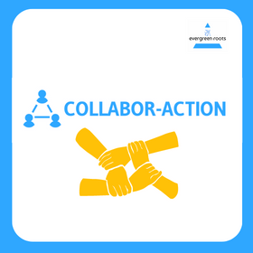

# collabor-action

## Project Overview 
As it currently stands, cross-sector partnerships between hospitals & community based organizations are under-performing & disoriented, leading to disparities in community-based health outreach. Additionally, workforce shortages are a top challenge for health care systems to reach underserved communities and make community-based care more accessible. Our objective with **collabor-action** was to create the infrastructure for an online platform that streamlines communication betweeen health care systems and CBOs, serving as a single access point for these organizations to discover, connect and form meaningful partnerships.

We developed the following features to support this mission:

- **Organization & Employee Registration** 
    - Users will be able to register their organization or themselves into our system, promoting cross-sector visibility and communication opportunities
- **Information Cards** 
    - Information cards provide users with pertinent information on an organization in the system, such as location, available services/specialties and contact information of the administrative team 
- **Message Form/Inbox** 
    - Users will be able to send and receive collaboration request forms to promote clear communication and planning between health care systems and CBOs

In doing so, we hope to facilitate clear communication and planning between these organizations to optimize the speed and outreach of health care services. 

__You can visit our website here:__ [collabor-action](https://collabor-action.azurewebsites.net/)

___

## Our Team 
- Anas Azeemi (aazeemi@uw.edu)
- Vincent Chen (vchen5@uw.edu)
- Christopher Kim (chris628@uw.edu)
- Saeid Mohamed (saeid135@uw.edu)
- Jonathan Trinh (tjon1008@uw.edu)

## Resources

|Resource Name|Link|
|-----------|-----------|
|Website Prototype & Wireframes| [Figma](https://www.figma.com/proto/e8zUsCE0Keh35pdWbtljdo/Capstone-Project-Prototype-2?node-id=1-35&scaling=min-zoom&page-id=0%3A1&starting-point-node-id=1%3A1068)|
|Final Presentation| [Slides](https://docs.google.com/presentation/d/1HO_Gbb9zFn6xtqrn0dmXbMgqcaScAZrmkY_mccyp3Rs/edit?usp=sharing)|
|collabor-action| [Github Repo](https://github.com/Saeid135/evergreen-roots.git)|
|collabor-action| [Website](https://collabor-action.azurewebsites.net/)|

___

## Future iSchool Capstone Team
If you’re a future iSchool Capstone team that is interested in continuing this project, **please reach out** to Anas Azeemi via email at aazeemi@uw.edu.

### Where to Start
We recommend that you do more user research with healthcare systems & CBOs to ensure the platform is meeting the stakeholders needs. This research would also be useful in priority setting the development of features. As a starting point, we believe developing the following features would help improve the platform:

- Survey to assess the capabilities, strengths, weaknesses of CBOs & healthcare systems 
- Proximity map of CBOs & healthcare systems 
- Ability to share possible collaborative events 
- Allowing each organization to choose 3-5 tags to describe themselves & be sorted accordingly 

